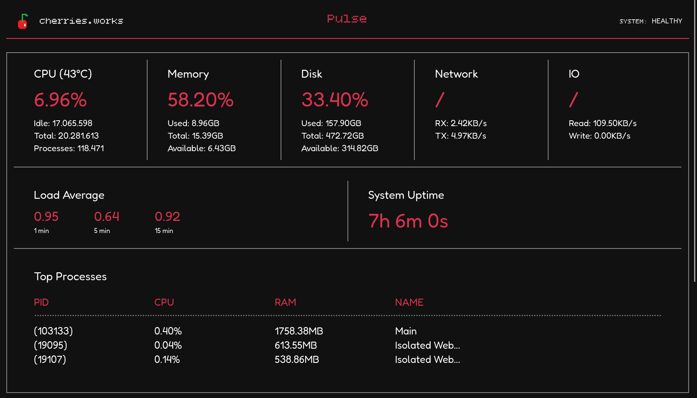
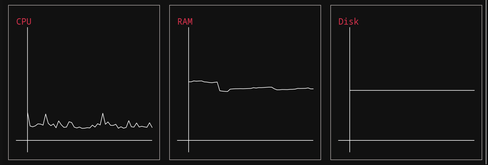

# Pulse

Lightweight Linux system monitoring dashboard written in C.

Pulse collects system metrics directly from Linux and exposes them through a minimal web dashboard. The simplicity, such as no accounts, or no setup is not a design flaw, its the goal of Pulse.

A fast, simple, and efficient monitoring system that just works.




## Features

* CPU usage
* Memory usage
* Disk usage
* Disk I/O statistics
* Network statistics
* Load averages
* Uptime
* Running processes
* Web hosting
* Graphical display
* Historical metrics
* Charts library

## Philosophy

Pulse aims to be the fastest way to set up monitoring:

* Fast
* Lightweight
* Self-hosted
* Easy to deploy
* Low resource usage

## Installation

```bash
  $ git clone https://github.com/cherries-works/pulse.git
  $ cd pulse
  $ make
  $ ./pulse
```

To get Pulse running on the web, add the `--web` argument.
By default Pulse runs on:

```
http://localhost:8080
```

The port can be changed with `--port [number]`, which omits the `--web` argument.

## API

Metrics are available as JSON:

```http
GET /api/metrics
```

Example response:

```json
{
  "error": null,
  "success": true,
  "timestamp": 1781131285,
  "cpu": {
    "idle": 9096832,
    "total": 9973308,
    "processes": 30307
  },
  "disk": {
    "available": 70075166720,
    "total": 97574191104,
    "reads": 283625,
    "writes": 0
  },
  "memory": {
    "available": 9560580,
    "total": 16141972
  },
  "network": {
    "rx": 195424940,
    "tx": 80206860
  },
  "load": {
    "load1": 1.87,
    "load5": 1.41,
    "load15": 1.17
  },
  "processes": [
    {
      "pid": 4503,
      "ram": 795660,
      "cpu": 10834,
      "name": "zen"
    },
    {
      "pid": 5384,
      "ram": 604400,
      "cpu": 23994,
      "name": "Isolated Web Co"
    },
    {
      "pid": 7235,
      "ram": 518428,
      "cpu": 25023,
      "name": "Discord"
    }
  ],
  "uptime": 14625
}
```

Historical metrics are available aswell:

```http
GET /api/history/{cpu | ram | disk}
```

Example response:

```json
{
  "error": null,
  "success": true,
  "timestamp": 1783110731,
  "data": [
    {
      "timestamp": 1783110719,
      "usage": 13.801922
    },
    {
      "timestamp": 1783110721,
      "usage": 14.735517
    },
    {
      "timestamp": 1783110723,
      "usage": 10.957178
    },
    {
      "timestamp": 1783110725,
      "usage": 12.781956
    },
    {
      "timestamp": 1783110727,
      "usage": 16.316441
    },
    {
      "timestamp": 1783110729,
      "usage": 10.297767
    }
  ]
}
```

## Roadmap

* Process sorting
* Network throughput
* Disk throughput
* Additional system statistics
* More OS support

## License

MIT
